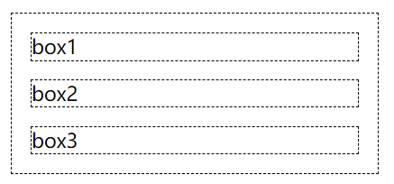
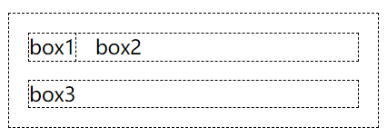

##### 引入

- 外部样式表：CSS与HTML放在不同文件中，并在HTML中`<head>`内使用`<link>`标签引入CSS。

```html
<head>
    <link href="index.css" rel="stylesheet" type="text/css" />
</head>
```

- 内部样式表：CSS与HTML放在同一文件中，在`<head>`中`<style>`定义CSS样式。

```html
<head>
	<style type="text/css">
          p{color:Red;}      
   </style>
</head>
<body>
    <p>something...</p> 
</body>
```

- 内联样式表：在标签的style属性中定义CSS。

```html
<body>
    <p style="color:Red; ">something...</p>
</body>
```

##### id&class

id：元素的唯一标识，不可重复。

class：单个标签可定义多个class，不同标签可设置相同class。

注：id也可写成name，name是HTML中的标准，id是XHTML中的标准。

##### 选择器

用法：选择器{属性1:值1;属性2:值2;...}

**基本使用**

```css
/* 元素选择器 */ 
div{color: red;}
/* id选择器 */ 
#id{color:green;}
/* class选择器 */
.class{color: blue;}
```

**组合使用**

```css
/* 子元素选择器 */
#id1 #id2{color:red;}
/* 相邻选择器 */
#id1+h5{color:green;}
/* 群组选择器 */
p,span {color: blue;}
```

子元素选择器：为子元素设置样式，父元素和子元素使用空格间隔开。

相邻选择器：选中元素元素的下一个元素（同级），使用加号间隔开。

群组选择器：为多个元素设置相同的样式，使用逗号分割选择的元素。

```html
<!DOCTYPE html>
<head>
    <title>css</title>
    <link href="./style.css" rel="stylesheet" type="text/css" />
</head>
<body>
    <h1>元素选择器</h1>
    <h2 id="id">id选择器</h2>
    <h3 class="class">class选择器</h3>
    <div id="id1">
        <h4 id="id2">子元素选择器</h4>
    </div>
    <h5>相邻选择器</h5>
    <p>群组选择器</p>
    <span>群组选择器</span>
</body>
</html>
```


##### 文本

- 字体

| 属性        | 说明                            |
| :---------- | :------------------------------ |
| font-family | 字体名（微软雅黑...）           |
| font-size   | 大小                            |
| font-weight | 粗细（bold、normal）            |
| font-style  | 斜体（normal、italic、oblique） |
| color       | 颜色                            |

注：如要让字体倾斜，但是没有斜体变量italic的特殊字体时，应使用oblique。

- 段落

| 属性            | 说明                           |
| :-------------- | :----------------------------- |
| text-decoration | 下划线、删除线、顶划线         |
| text-transform  | 文本大小写                     |
| font-varient    | 将英文文本转换为“小型”大写字母 |
| text-indent     | 段落首行缩进                   |
| text-align      | 文本水平对齐方式               |
| line-height     | 行高（不是行间距）             |
| letter-spacing  | 字距                           |
| word-spacing    | 词距（以空格为基准进行调节）   |

| 属性值 text-decoration | 说明   |
| :--------------------- | :----- |
| none                   | 默认值 |
| underline              | 下划线 |
| line-through           | 删除线 |
| overline               | 顶划线 |

该属性可以去除`<a>`的默认样式下划线。

| 属性值 text-transform | 说明                           |
| :-------------------- | :----------------------------- |
| none                  | 默认值，无转换发生             |
| uppercase             | 转换成大写                     |
| lowercase             | 转换成小写                     |
| capitalize            | 每个英文单词的首字母转换成大写 |

| font-variant属性值 | 说明               |
| :----------------- | :----------------- |
| normal             | 默认值，正常效果   |
| small-caps         | 小型大写字母的字体 |

```html
<html>
<head>
<style type="text/css">
p.normal {font-variant: normal}
p.small {font-variant: small-caps}
</style>
</head>
<body>
<p class="normal">This is a paragraph</p>
<p class="small">This is a paragraph</p>
</body>
</html>
```


| 属性 text-align | 说明           |
| :-------------- | :------------- |
| left            | 默认值，左对齐 |
| center          | 居中对齐       |
| right           | 右对齐         |

##### 边框

| 属性         | 说明                           |
| :----------- | :----------------------------- |
| border-width | 边框的宽度                     |
| border-style | 边框的外观（solid、dashed...） |
| border-color | 边框的颜色                     |

```css
/* 写法1 */
border-width:1px;
border-style:solid;
border-color:Red;
/* 写法2 */
border:1px solid Red;
```

局部样式


```css
/* 上边框 */
border-top-width:1px;
border-top-style:solid;
border-top-color:red;
/* 下边框 */
border-bottom-width:1px;
border-bottom-style:solid;
border-bottom-color:orange;
/* 左边框 */
border-left-width:1px;
border-left-style:solid;
border-left-color:blue;
/* 右边框 */
border-right-width:1px;
border-right-style:solid;
border-right-color:red;
/* 简洁写法 */
border-top:1px solid red;
border-bottom:1px solid orange;
border-left:1px solid blue;
border-right:1px solid red;
```

##### 背景

- 颜色

| 属性             | 说明         |
| ---------------- | ------------ |
| background-color | 定义背景颜色 |

color&background-color的区别：前者是设置文本颜色，后者是设置背景颜色。

- 图像

| 属性                  | 说明                         |
| --------------------- | ---------------------------- |
| background-image      | 图像路径                     |
| background-repeat     | 图像显示方式                 |
| background-position   | 背景图像在元素哪个位置       |
| background-attachment | 定义背景图像是否随内容而滚动 |

**属性** background-image:url("图像地址");

| 属性 background-repeat | 说明                                     |
| :--------------------- | :--------------------------------------- |
| repeat                 | 在水平方向和垂直方向上同时平铺（默认值） |
| repeat-x               | 只在水平方向（x轴）上平铺                |
| repeat-y               | 只在垂直方向（y轴）上平铺                |
| no-repeat              | 不平铺                                   |

| 属性 background-repeat | 说明           |
| :--------------------- | :------------- |
| top left               | 左上           |
| top center             | 靠上居中       |
| top right              | 右上           |
| center left            | 居中靠左       |
| center center          | 正中           |
| center right           | 居中靠右       |
| bottom left            | 左下           |
| bottom center          | 靠下居中       |
| bottom right           | 右下           |
| x y                    | 自定左边和顶边 |

| 属性 **background-attachment** | 说明                                   |
| :----------------------------- | :------------------------------------- |
| scroll                         | 随元素一起滚动（默认值）               |
| fixed                          | 固定不动（如：固定在页面右下角的广告） |

##### 超链接伪类

| 属性      | 说明                     |
| :-------- | :----------------------- |
| a:link    | 定义a元素未访问时的样式  |
| a:visited | 定义a元素访问后的样式    |
| a:hover   | 定义鼠标经过显示的样式   |
| a:active  | 定义鼠标单击激活时的样式 |

注：伪类需按顺序定义，不然浏览器可能无法正常显示。(W3C的规定)

```html
<!DOCTYPE html>
<head>
    <title>:hover伪类</title>
    <style type="text/css">
        span:hover {

            color: white;
            background-color: black;
        }
    </style>
</head>
<body>
    <span>绿叶学习网</span>
</body>
</html>
```

##### 鼠标

```css
cursor:default;
```


##### 图片

| 属性           | 说明                       |
| -------------- | -------------------------- |
| width          | 图像宽                     |
| height         | 图像高                     |
| border         | 边框（详看边框篇）         |
| text-align     | 水平对齐                   |
| vertical-align | 垂直对齐（相对于行内元素） |

| 属性 text-align | 说明           |
| :-------------- | :------------- |
| left            | 默认值，左对齐 |
| center          | 居中对齐       |
| right           | 右对齐         |

注：属性text-align只对文本和img标签有效，其他标签无效。

| 属性 vertical-align | 说明                                     |
| :------------------ | :--------------------------------------- |
| top                 | 顶部对齐                                 |
| middle              | 中部对齐                                 |
| baseline            | 默认，基线对齐（元素放置在父元素的基线） |
| bottom              | 底部对齐                                 |
| sub                 | 垂直对齐文本的下标                       |
| super               | 垂直对齐文本的上标                       |
| text-top            | 与父元素字体的顶端对                     |
| text-bottom         | 与父元素字体的底端对齐                   |
| inherit             | 从父元素继承 vertical-align 属性         |


**图文混排**

| 属性 float | 说明         |
| :--------- | :----------- |
| left       | 元素向左浮动 |
| right      | 元素向右浮动 |

该属性可实现文字环绕图像的效果。

```html
<!DOCTYPE html>
<head>
    <title>CSS浮动float属性</title>
</head>
<body>
    
    <p>long long str...</p>
</body>
</html>
```

##### 列表

- 有序列表

| 属性 list-style-type | 说明                     |
| :------------------- | :----------------------- |
| decimal              | 默认值，数字1、2、3……    |
| lower-roman          | 小写罗马数字i、ii、iii…… |
| upper-roman          | 大写罗马数字I、II、III…… |
| lower-alpha          | 小写英文字母a、b、c……    |
| upper-alpha          | 大写英文字母A、B、C……    |

- 无序列表

| 属性 list-style-type | 说明            |
| :------------------- | :-------------- |
| disc                 | 默认值，实心圆● |
| circle               | 空心圆○         |
| square               | 实心正方形■     |

- 去除列表项符号![list-style-image属性]

| 属性 list-style-type | 说明           |
| :------------------- | :------------- |
| none                 | 去除列表项符号 |

- 自定义列表项符号

```css
list-style-image:url(图像地址);
```

(css.assets/trig.png)

```html
<!DOCTYPE html>
<head>
    <title>list-style-image属性</title>
    <style type="text/css">
        ul {
            list-style-image: url("trig.png");
        }
    </style>
</head>
<body>
    <ul>
        <li>HTML</li>
        <li>CSS</li>
        <li>JavaScript</li>
    </ul>
</body>
</html>
```


##### 表格

| 属性 border-collapse | 说明                               |                                                              |
| :------------------- | :--------------------------------- | ------------------------------------------------------------ |
| collapse             | 边框合并，如果相邻，则共用一个边框 |              |
| separate             | 默认值，边框分开，不合并           |              |
| border-spacing       | 设置边框间距                       |  |
| caption-side         | 设置标题位置                       |                                                              |

| 属性值 caption-side | 说明               |                                                              |
| :------------------ | :----------------- | ------------------------------------------------------------ |
| top                 | 默认值，标题在顶部 |              |
| bottom              | 标题在底部         |  |

##### 盒子模型


| 属性              | 说明                                           |
| :---------------- | :--------------------------------------------- |
| content（内容）   | 文字或图片                                     |
| padding（内边距） | 内容与边框间的距离                             |
| border（边框）    | 元素边框                                       |
| margin（外边距）  | 元素与元素间的距离（为负数时可实现元素的重叠） |

| 属性值 display | 说明                                                         |
| -------------- | ------------------------------------------------------------ |
| block          | 独占一行，对宽高的属性值生效；如不给宽度，就默认为浏览器的宽度，即就是100%宽。 |
| inline         | 可以多个标签存在一行，对宽高属性值不生效，完全靠内容撑开宽高。 |
| inline-block   | 结合的行内和块级的优点，既可以设置长宽，可以让padding和margin生效，又可以和其他行内元素并排。 |


```css
padding/margin:四方向像素值;
padding/margin:顶底像素值1 左右像素值2;
padding/margin:顶像素值1 右像素值2 底像素值3 左像素值4;/*从顶端开始按顺时针旋转*/
```

##### 浮动布局

文档流：元素在页面出现的先后顺序

正常文档流：将窗体自上而下分成一行一行，块元素独占一行，相邻行内元素在每行中按从左到右地依次排列元素。

脱离正常文档流：使用CSS控制，控制元素的显示位置，让其的显示位置与文档代码顺序不同。

```html
<div id="div1"></div>
<div id="div2"></div>
<div id="div3"></div>
<div id="div4"></div>
<div id="div5"></div>
```

| 正常文档流                                                   | 脱离正常文档流                                               |
| ------------------------------------------------------------ | ------------------------------------------------------------ |
|  |  |

| 属性值 float | 说明         |
| :----------- | :----------- |
| left         | 元素向左浮动 |
| right        | 元素向右浮动 |

```html
<!DOCTYPE html>

<head>
    <title>Document</title>
    <style type="text/css">
        div {
            margin: 15px;
            border: 1px dashed black;
            max-width: 300px;
        }
    </style>
</head>

<body>
    <div>
        <div id="box1" style="float: left;">box1</div>
        <div id="box2">box2</div>
        <div id="box3">box3</div>
    </div>
</body>

</html>
```

| float           | 效果                                                         |
| --------------- | ------------------------------------------------------------ |
| none            |  |
| box1            |  |
| box1、box2      |  |
| box1、box2、bo3 |  |

注：相邻元素中，仅有1个为float时，两元素紧贴；两元素素均为float时，按margin隔开距离。

| 属性值 clear | 说明             |
| :----------- | :--------------- |
| left         | 清除左浮动       |
| right        | 清除右浮动       |
| both         | 左右浮动一起清除 |

| clear 前                                                     | clear 后                                                     |
| ------------------------------------------------------------ | ------------------------------------------------------------ |
|  |  |

```html
<!DOCTYPE html>

<head>
    <title>Document</title>
    <style type="text/css">
        div {
            margin: 15px;
            border: 1px dashed black;
            max-width: 300px;
        }
        p {
            border: 1px dashed black;
        }
    </style>
</head>

<body>
    <div style="padding: 10px;">
        <div id="box1" style="float: left;">box1</div>
        <div id="box2" style="float: left;">box2</div>
        <div id="box3" style="float: right;">box3</div>
        <p style="clear: both;">这里是浮动框外围的文字，这里是浮动框外围的文字，这里是浮动框外围的文字，这里是浮动框外围的文字，这里是浮动框外围的文字，这里是浮动框外围的文字，</p>
    </div>
</body>

</html>
```

##### 定位布局

| 属性值 postion | 说明                                                         |
| -------------- | ------------------------------------------------------------ |
| fixed          | 固定定位，相对浏览器的四边，其位置不随滚动条的拖动而改变。   |
| relative       | 相对定位，相对元素自身原先位置移动，其原位置仍然会占位，不会将后方的元素挤上来。 |
| absolute       | 绝对定位，相对浏览器的四边，其位置随滚动条的拖动而改变。     |
| static         | 静态定位，默认                                               |

```css
position:布局方式;
top:像素值;
bottom:像素值;
left:像素值;
right:像素值;
```

**相对定位**

```html
<!DOCTYPE html>

<head>
    <title>CSS相对定位</title>
    <style type="text/css">
        #father {
            margin-top: 30px;
            margin-left: 30px;
            width: 200px;
            border: 1px solid silver;
        }

        #father div {
            width: 100px;
            height: 60px;
            margin: 10px;
            border: 1px solid silver;
        }

        #son2 {
            position: relative;
            top: 20px;
            left: 40px;
        }
    </style>
</head>

<body>
    <div id="father">
        <div id="son1">1无定位</div>
        <div id="son2">2相对定位</div>
        <div id="son3">3无定位的</div>
    </div>
</body>

</html>
```


