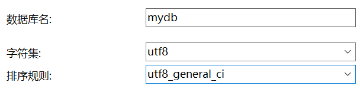
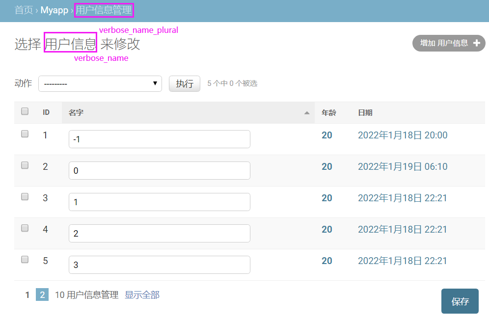

# Django3.2

#### 项目初始化

安装LTS版本：`$ pip install django==3.2.*`  

注：pip下载太慢可在其后补上 `-i https://pypi.tuna.tsinghua.edu.cn/simple`

检查安装的版本：`$ python -m django --version`

在桌面上按住`shift`键，然后右键，可快速打开命令行窗口。

创建项目：`$ django-admin startproject myweb`

- 【参数】项目名：myweb

进入项目目录：`$ cd myweb`

运行项目（仅自己可访问）：`$ python manage.py runserver 8000` 

- 【参数】端口：可省略，默认8000

浏览器内访问：`localhost:8000` `127.0.0.1:8000`

##### 创建应用

创建应用程序：`$ python manage.py startapp myapp`

- 【参数】应用名：myapp

将应用添加到`myweb/settings.py`中：

```python
INSTALLED_APPS = [
    'django.contrib.admin',
    'django.contrib.auth',
    'django.contrib.contenttypes',
    'django.contrib.sessions',
    'django.contrib.messages',
    'django.contrib.staticfiles',
    'myapp.apps.MyappConfig', # 或简写`myapp`
]
```

##### 目录结构

```
myweb/
├── manage.py
├── myweb
│   ├── __init__.py		# 空文件，告诉python该目录应该被认为是python包
│   ├── settings.py		# django项目配置
│   ├── urls.py			# url与函数的绑定
│   └── wsgi.py
└── myapp
    ├── admin.py		# 管理员系统
    ├── apps.py
    ├── __init__.py
    ├── migrations		# 数据库迁移文件
    │   └── __init__.py
    ├── models.py		# 数据库字段管理
    ├── tests.py
    └── views.py		# 响应网页请求
```

---

##### 允许局域网内的IP访问

①运行项目：`$ python manage.py runserver 0.0.0.0:8000`

- 【参数】端口：8000 

②获取本机IPv4：`$ ipconfig`

③配置`myweb\settings.py`：

- 允许所有人访问：`ALLOWED_HOSTS = ['*']`
-  允许指定IP访问：`ALLOWED_HOSTS = ['192.168.3.20']`  
-  允许指定IP段访问：`ALLOWED_HOSTS = ['192.168.*.*']` 

④浏览器内访问：`ipv4:port`

- 【参数】ipv4：①中获得的值
- 【参数】port：②中获得的值

---

#### URL路由

URL：统一资源定位器 (Uniform Resource Locator），网络上的资源路径。（eg：省-市-县-街道-小区-门牌号）

路由：用于选择一条从网络数据包发送到目的地址的最优质最快捷的路线。（eg：远距离用航空，近距离用汽运...）

**作用**：将URL映射到指定的函数。

##### 请求处理

加载`settings.py`中的`ROOT_URLCONF`(URL configuration)所指向的python包，寻找其内的`urlpatterns`变量，该变量是`django.urls.path()`和`django.urls.re_path()`实例的序列(sequence)。然后从上到下进行每个URL模式，遇到匹配成功后，不会继续向下匹配。之后进入相匹配URL所绑定的视图`views`中。如过程出现异常，则会调用错误处理视图。

```python
# myweb/settings.py
ROOT_URLCONF = 'myweb.urls'
# myweb/urls.py （根据ROOT_URLCONF寻得）
from django.contrib import admin
from django.urls import path,re_path
urlpatterns = [
    path('admin/', admin.site.urls),
]
```

**路径转换器** path ：`<type:name>`，捕获类型type，形参名name

| 路径转换器 |                                                              | 返回类型 |
| ---------- | ------------------------------------------------------------ | -------- |
| str        | 匹配任何非空字符串，除了路径分隔符除外'/'                    | str      |
| int        | 匹配零或任何正整数                                           | int      |
| slug       | 匹配由ASCII字母或数字以及连字符和下划线字符组成的字符串（eg：building-your-1st-django-site） | str      |
| uuid       | 匹配格式化的UUID（eg：075194d3-6885-417e-a8a8-6c931e272f00） | str      |
| path       | 匹配任何非空字符串，包括路径分隔符 '/'                       | str      |

**正则表达式** re_path：`(?P<name>pattern)`，捕获表达式pattern，形参名name，其返回类型都是str型。

注：python中得`r''`表示字符串里的内容为正则表达式，正则表达式中`^`代表着以什么为开始，`$`代表着以什么结束。

注：可使用用未命名的正则表达式组`(pattern)`，eg：`(?P<year>[0-9]{4})`→`([0-9]{4})` （不推荐）

**反向解析**：根据路由别名反向生成url的请求地址。

**示例**：

```python
# myweb/urls.py
from django.urls import path,include
urlpatterns = [
    path('',include('myapp.urls')), # 导入子路由（url过多时，可用该方式来管理url）
]
# myapp/urls.py （需手动创建该目录）
from django.urls import path,re_path,re_path
from . import views # 导入同目录下的views
urlpatterns = [
    path('',views.index,name='index'), # 给路由起别名：该路由别名是index
 	# 路径转换器 & 正则表达式
    path('articles/<int:year>/<int:month>/',views.articles, name="articles"),
    re_path(r'^blogs/(?P<year>[0-9]{4})/(?P<month>[0-9]{2})/$', views.blogs), 
    # 视图函数含默认值时
    path('page/',views.pages), # <int:value>值留空时调用该词句
    path('page/<int:value>/',views.pages), # <int:value>值不为空时调用该词句
    # 反向解析例子
	path('reverse/',views.func), 
]
# myapp/views.py
from django.http import HttpResponse,HttpResponseRedirect
from django.shortcuts import redirect
from django.urls import reverse
def index(request):
	return HttpResponse("index")
def articles(request,year,month):
    return HttpResponse("%d.%d"%(year,month))
def blogs(request,year,month):
    return HttpResponse("%s.%s"%(year,month))
def pages(request,value=1):
    return HttpResponse("%d"%(value))
def func(request):
    print(reverse("index")) # 输出 /myapp/
    print(reverse('articles', args=(1, 2))) # 输出 /myapp/articles/1/2/
    print(reverse('articles', kwargs={"year":1, "month":2})) # 输出 /myapp/articles/1/2/
    return HttpResponseRedirect(reverse('articles', args=(1, 2)))
	# return redirect(reverse('articles', args=(1, 2)))
```

别名的作用：

`myapp/tmeplates/mysite.html`

```html
<!DOCTYPE html>
<html lang="en">
<head>
    <meta charset="UTF-8">
    <title>mysite</title>
</head>
<body>
     <!-- 自动转换为别名为index的url地址 -->
</body>
</html>
```

##### 404

`myweb/settings.py`：

```python
DEBUG = False
TEMPLATES = [{'DIRS': [os.path.join(BASE_DIR,'templates')] }] # 把根目录下的templates目录添加到路径中
```

`templates/404.html` （需手动在项目根目录新建templates目录）

```html
<!DOCTYPE html>
<html>
<head>
    <title>404</title>
</head>
<body>
    <center>
        <h2>404 not found</h2>
        <h3>{ {   Exception   } }</h3>
    </center>
</body>
</html>
```

`myapp/views.py`

```python
from django.http import Http404
def func(request): # 可在自定义的函数里抛出错误/也可访问错误的url路径
	raise Http404('error') 
```

---

#### 模型层`Model`

**作用**：负责业务对象和数据库的关系映射（ORM）。（ORM：Object Relational Mapping 对象-关系-映射）

提供了`crud`操作（数据库的增删改查：增加(Create)、检索(Retrieve)、更新(Update)和删除(Delete)）

**用途**：①根据对象类型生成表结构 ②将对对象和列表的操作转换为sql语句 ③将sql查询结果转换为对象或列表

##### 数据库配置

①安装MySQL：`$ pip install  mysqlclient`

②登录并连接MySQL数据库

③创建数据库：`$ create databases mydb default charset=utf8`

* 【参数】数据库名：mydb



④在`myweb/settings.py`中配置数据库连接信息：

```python
DATABASES = {
    'default': {
        'ENGINE': 'django.db.backends.mysql',
        'NAME': 'mydb',
        'USER': 'root',
        'PASSWORD': '',
        'HOST': 'localhost',
        'PORT': 3306',
        }
}
```

内置的数据库后端有：

```python
'django.db.backends.postgresql'
'django.db.backends.mysql'
'django.db.backends.sqlite3'
'django.db.backends.oracle'
```

⑤在`myapp/models.py`中定义模型类(继承于`models.Model`，因为要用封装好的`curd`操作)并设置字段：

```python
from django.db import models
from datetime import datetime
class User(models.Model):
    #id = models.AutoField(primary_key=True) # 默认含有该主键字段，可省略不写
    name = models.CharField('名字',max_length=32)
    age = models.IntegerField('年龄',default=20)
    time = models.DateTimeField('日期',default=datetime.now)
    
    # 元信息设置
    class Meta:
        # db_table = "myapp_users"  # 指定表名 默认表名`<app_name>_<model_name>`
 	 	# ordering = ['id'] # 默认排序字段 正序['id'] 倒序['-id']
        verbose_name = '用户信息'
        verbose_name_plural = '用户信息管理'
    
    # 定义输出值（print）
    #def __str__(self):
    #    return "%d % %d"%(self.id,self.name,self.age) 
```

在Admin系统中的效果：



字段命名限制：不能为python的保留关键字，不能使用连续的下划线。

字段类型：

- AutoField：根据实际ID自动增长的 IntegerField
- BooleanField：true/false
- NullBooleanField：  null/true/false
- CharField：字符串
  - 【参数】max_length：最大字符长度
- TextField：大文本（通常超4000字使用）
- IntegerField：整数
- FloatField：使用python的float来表示浮点数
- DecimalField：使用python的decimal来表示十进制浮点数
  - 【参数】max_digits：位数的总数
  - 【参数】decimal_places：小数所占位数
- DateField：使用python的datetime.data来表示日期
- TimeField：使用python的datetime.time来表示时间
- DateTimeField：使用python的datetime.datetime来表示日期时间
  - 【参数】auto_now：每次保存对象时，自动设置该字段为当前时间
  - 【参数】auto_now_add：当对象被首次创建时，自动设置该字段为当前时间
- FileField：上传文件
- ImageField：上传图片，继承自FileField，对上传的文件进行校验，确保其为有效的image

字段约束：

- primary_key：设置为该模型的主键字段
- null：`数据库范畴 ` 允许将空值以NULL存储到数据库中 
- blank： `表单验证范畴 ` 允许该字段在表单验证时为空
- db_column：字段名称，默认使用属性名(即等于号左边的标识符)
- db_index：为此字段创建索引
- unique：在表中必须有唯一值

⑥激活模型：将`myapp.apps.MyappConfig`添加至`myweb/settings.py`的`INSTALLED_APPS  `中

⑦生成迁移文件：`$ python manage.py makemigrations`（会在`myapp/migrations`目录下生成`xxxx_initial.py`文件。）

⑧执行迁移：`$ python manage.py migrate`

##### 启用Admin管理

`myweb/settings.py`的`INSTALLED_APPS`默认自带以下`app`

```python
INSTALLED_APPS  =  [ 
    'django.contrib.admin' ，
    'django.contrib.auth' ，
    'django.contrib.contenttypes' ，
    'django.contrib.sessions' ，
    'django.contrib.messages' ，
    'django.contrib.staticfiles' ，
]
```

`myweb/urls.py`默认自带`admin`路由

```python
from django.contrib import admin
from django.urls import path
urlpatterns = [
    path('admin/', admin.site.urls),
]
```

为使用django自带的app，需在数据库中创建对应的表

因此需执行数据结构迁移命令：`$ python manage.py migrate`

```
+----------------------------+
| Tables_in_mydb	         |
+----------------------------+
| auth_group                 |
| auth_group_permissions     |
| auth_permission            |
| auth_user                  |
| auth_user_groups           |
| auth_user_user_permissions |
| django_admin_log           |
| django_content_type        |
| django_migrations          |
| django_session             |
+----------------------------+
```

创建管理员用户：`$ python manage.py createsuperuser`

```
# 输入用户名：
Username: admin
# 输入电子邮件地址：
Email address: admin@example.com
# 输入密码（>=8位）：
Password: **********
Password (again): *********
Superuser created successfully.
```

启用服务器：`$ python manage.py runserver`

浏览器内范围：`http://127.0.0.1:8000/admin/`

在`myweb/settings.py`中设置时区和语言：

```python
LANGUAGE_CODE = 'zh-hans'
TIME_ZONE = 'Asia/Shanghai'
# LANGUAGE_CODE = 'en-us'
# TIME_ZONE = 'UTC'
```

将自定义应用添加至后台管理，在`myapp/admin.py`中：

```python
from django.contrib import admin
# Register your models here.
from myapp.models import User
# 1.普通写法
# admin.site.register(Users)
# 2.装饰器写法
@admin.register(User)
class UserAdmin(admin.ModelAdmin):
    # 设置要显示的字段
    list_display = ('id','name','age','time')
    # 设置默认可编辑字段（可直接在数据展示页面中编辑）
    list_editable = ['name']
    # 设置哪些字段可编辑（点击数据单元格后进入编辑页面内编辑）
    list_display_links = ('age','time')
    # 设置每页显示多少条记录 （默认100条）
    list_per_page = 8
    # 设置默认排序字段
    ordering = ('id',) # -id 表示降序
```

---

#### 视图层`View`

在`myapp/views.py`内：

①不使用模板，直接返回数据

```python
from django.http import HttpResponse
def index(request):
    return HttpResponse("Hello world")
```

②调用模板并返回数据

```python
from django.shortcuts import render
def index(request):
	return render(request,'index.html',{'info':'Hello world'})
```

③重定向网页

```python
from django.http import redirect
def index(request):
	return redirect("https://www.baidu.com/")
```

---

