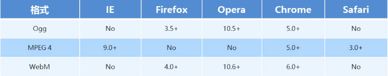

https://www.w3school.com.cn/tags/att_input_type.asp

# HTML

`结构`HTML、`表现`CSS、`行为`JavaScript

- HTML：`超文本标记语言` Hyper Text Markup Language
- CSS：`层叠样式表` Cascading Style Sheets

**extra**：

- Ajax：`异步JavaScript和XML` Asynchronous Javascript And XML

指创建交互式网页应用的网页开发技术。

通过z哎后台与服务器进行少量的数据交换，实习那网页的异步更新。

即可在不重新加载整个页面的情况下，对页面的部分内容进行更新。

不适用Ajax的传统网页如需更新内容，必须重新加载整个页面。

- SEO：`搜索引擎优化` Search Engine Optimization

利用搜索引擎的搜索规则提高网站在搜索结果中的自然排名。

---

HTML基本结构


`<head>`标签：定义些特殊内容，在浏览器内不可见

`<body>`标签：定义展示内容，在浏览器内可见

| `<head>` 内部标签 |                                        |
| ----------------- | -------------------------------------- |
| `<title>`         | 定义网页的标题                         |
| `<meta>`          | 定义网页的基本信息（供搜索引擎）       |
| `<style>`         | 定义CSS样式                            |
| `<link>`          | 链接外部CSS文件或脚本文件              |
| `<script>`        | 定义脚本语言                           |
| `<base>`          | 定义页面所有链接的基础定位（用得很少） |


##### 中英对照表


| 标签名   | 英文全称               | 中文解释             |
| :------- | :--------------------- | :------------------- |
| div      | division               | 分割（块元素）       |
| span     | span                   | 区域（行内元素）     |
| p        | paragraph              | 段落                 |
| ol       | ordered list           | 有序列表             |
| ul       | unordered list         | 无序列表             |
| li       | list item              | 列表项               |
| dl       | definition list        | 定义列表             |
| dt       | definition term        | 定义术语             |
| dd       | definition description | 定义描述             |
| h1~h6    | header1 ~header6       | 标题1~标题6          |
| hr       | horizontal rule        | 水平线               |
| a        | anchor                 | 锚点，超链接         |
| strong   | strong                 | 强调（粗体）         |
| em       | emphasized             | 强调（斜体）         |
| sup      | superscripted          | 上标                 |
| sub      | subscripted            | 下标                 |
| br       | break                  | 换行                 |
| fieldset | fieldset               | 域集                 |
| legend   | legend                 | 图例                 |
| caption  | caption                | （表格、图像等）标题 |
| thead    | table head             | 表头                 |
| tbody    | table body             | 表身                 |
| tfoot    | table foot             | 表脚                 |
| th       | table header           | 表头单元格           |
| td       | td                     | 表身单元格           |


**一般标签**：有开始符号和结束符号。eg：`<body></body>`

**自闭合标签**：只有开始符号没有结束符号。eg：`<br/>`、`<hr/>`

**块元素**：独占1行，排斥与其他元素位于同1行。eg：`h1~h6`、`p`、`hr`、`div`。

**行内元素**：可以合其他元素位于同1行。eg：`strong`、`em`、`span`。


##### 段落与文字

| 标签      | 语义            | 说明             |
| :-------- | :-------------- | :--------------- |
| `<h1>~<h6>` | header          | 标题             |
| `<p>`       | paragraph       | 段落             |
| `<br>`      | break           | 换行             |
| `<hr>`      | horizontal rule | 水平线           |
| `<div>`     | division        | 分割（块元素）   |
| `<span>`    | span            | 区域（行内元素） |

##### 文本格式

| 标签     | 语义                  | 说明 |
| :------- | :-------------------- | :--- |
| `<strong>` | strong（加强）        | 加粗 |
| `<em>`     | emphasized（强调）    | 斜体 |
| `<cite>`   | cite（引用）          | 斜体 |
| `<sup>`    | superscripted（上标） | 上标 |
| `<sub>`   | subscripted（下标）   | 下标 |

##### 特殊符号

即空格`&nbsp;`即可，1个汉字约等于3个`&nbsp;`。

| 特殊符号 | 说明           | 代码      |
| :------- | :-------------------- | :--- |
| ` ` | **空格** | `&nbsp` |
|`"`|双引号（英文）|`&quot;`|
|`‘`|左单引号|`&lsquo;`|
|`’`|右单引号|`&rsquo;`|
|`×`|乘号|`&times;`|
|`÷`|除号|`&divide;`|
|`>`|大于号|`&gt;`|
|`<`|小于号|`&lt;`|
|`&`|“与”符号|`&amp;`|
|`—`|长破折号|`&mdash;`|
|`|`|竖线|`&#124;`|
|`§`|分节符|`&sect;`|
|`©`|版权符|`&copy;`|
|`®`|注册商标|`&reg;`|
|`™`|商标|`&trade;`|
|`€`|欧元|`&euro;`|
|`£`|英镑|`&pound;`|
|`¥`|日元|`&yen;`|
|`°`|度|`&deg;`|

##### 列表

| 标签 | 语义            | 说明     |
| :--- | :-------------- | :------- |
| ol   | ordered list    | 有序列表 |
| ul   | unordered list  | 无序列表 |
| dl   | definition list | 定义列表 |

* 有序列表

```html
<ol type="I">
    <li>有序列表项</li>
    <li>有序列表项</li>
    <li>有序列表项</li>
</ol>
```

| 属性值type | 列表项的序号类型         |
| :--------- | :----------------------- |
| 1          | 默认值，数字1、2、3……    |
| a          | 小写英文字母a、b、c……    |
| A          | 大写英文字母A、B、C……    |
| i          | 小写罗马数字i、ii、iii…… |
| I          | 大写罗马数字I、II、III…… |

* 无序列表

```html
<ul type="square">
    <li>有序列表项</li>
    <li>有序列表项</li>
    <li>有序列表项</li>
</ul>
```

| 属性值type | 列表项的序号类型 |
| :--------- | :--------------- |
| disc       | 默认值，实心圆●  |
| circle     | 空心圆○          |
| square     | 实心正方形■      |

* 定义列表

```html
<dl>
    <dt>定义名词</dt>
    <dd>定义描述</dd>
    ……
</dl>
```

`<dl>`：定义列表 definition list
`<dt>`：定义名词 definition term
`<dd>`：定义描述 definition description

##### 表格

表格基本标签

| 标签  | 语义                          | 说明   |
| :---- | :---------------------------- | :----- |
| table | table（表格）                 | 表格   |
| tr    | table row（表格行）           | 行     |
| td    | table data cell（表格单元格） | 单元格 |

```html
<table>
    <tr>
        <td>单元格1</td>
        <td>单元格2</td>
    </tr>
    <tr>
        <td>单元格1</td>
        <td>单元格2</td>
    </tr>
</table>
```

表格结构标签

| 标签    | 语义         | 说明               |
| :------ | :----------- | :----------------- |
| caption |              | 表格标题           |
| thead   | table head   | 表头（会自动加粗） |
| tbody   | table body   | 表身               |
| tfoot   | table foot   | 表脚               |
| th      | table header | 表头单元格         |

```html
<table>
    <caption>表格标题</caption>
    <!--表头-->
    <thead>
        <tr>
            <th>表头单元格1</th>
            <th>表头单元格2</th>
        </tr>
    </thead>
    <!--表身-->
    <tbody>
        <tr>
            <td>标准单元格1</td>
            <td>标准单元格2</td>
        </tr>
        <tr>
            <td>标准单元格1</td>
            <td>标准单元格2</td>
        </tr>
    </tbody>
    <!--表脚-->
    <tfoot>
        <tr>
            <td>标准单元格1</td>
            <td>标准单元格2</td>
        </tr>
    </tfoot>
</table>
```

| `<td>`属性 | 释意   |
| ---------- | ------ |
| rowspan    | 合并行 |
| colspan    | 合并列 |

```html
用法：<td rowspan="跨度"> <td colspan="跨度">
```

```html
<!DOCTYPE html>

<head>
    <title>合并单元格</title>
</head>

<body>
    <!-- rowspan -->
    <table border="1">
        <!--第1行-->
        <tr>
            <td rowspan="2">1.1</td>
            <td>1.2</td>
        </tr>
        <!--第2行-->
        <tr>
            <td>2.2</td>
        </tr>
        <!--第3行-->
        <tr>
            <td>3.1</td>
            <td>3.2</td>
        </tr>
    </table>
    <!-- colspan -->
    <table border="1">
        <!--第1行-->
        <tr>
            <td colspan="2">1.1</td>
        </tr>
        <!--第2行-->
        <tr>
            <td>2.1</td>
            <td>2.2</td>
        </tr>
        <!--第3行-->
        <tr>
            <td>3.1</td>
            <td>3.2</td>
        </tr>
    </table>
</body>

</html>
```

##### 图像

自闭合标签``

| 属性   | 说明                           |           |
| :----- | :----------------------------- | --------- |
| src    | 图像的文件地址                 | source    |
| alt    | 图片显示不出来时的提示文字     | alternate |
| title  | 鼠标移到图片上的提示文字       |           |
| width  | 指定图形宽度，高度按等比例拉伸 |           |
| height | 指定图形高度，宽度按等比例拉伸 |           |

**相对路径**

- 同级目录：`image.png`
- 上级目录：`../iamge.png`
- 下级目录：`Images/image.png`

**图像格式**

- jpg：可以很好处理大面积调色的图像。
- png：体积小、无损压缩且支持透明通道，能保证网页的打开速度。
- gif：图像效果差，但可以制作动画。

##### 链接

```html
<a href="链接地址" target="打开方式">
```

| 属性值target | 说明                           |
| :----------- | :----------------------------- |
| _self        | 默认方式，即在当前窗口打开链接 |
| _blank       | 在一个全新的空白窗口中打开链接 |
| _top         | 在顶层框架中打开链接           |
| _parent      | 在当前框架的上一层里打开链接   |

- 外部链接

- 内部链接
  - 内部页面链接
  - 锚点链接：点击后会跳转到当前页面的某部分

```html
<!DOCTYPE html>

<head>
    <title>锚点链接</title>
</head>

<body>
    <div>
        <a href="#music">推荐音乐</a><br />
        <a href="#movie">推荐电影</a><br />
        <a href="#article">推荐文章</a><br />
    </div>
    ……<br />……<br />……<br />……<br />……<br />……<br />
    <div id="music">
        <h3>推荐音乐</h3>
        <ul>
            <li>林俊杰-被风吹过的下图</li>
            <li>曲婉婷-在我的歌声里</li>
            <li>许嵩-灰色头像</li>
        </ul>
    </div>
    ……<br />……<br />……<br />……<br />……<br />……<br />
    <div id="movie">
        <h3>推荐电影</h3>
        <ul>
            <li>蜘蛛侠系列</li>
            <li>钢铁侠系统</li>
            <li>复仇者联盟</li>
        </ul>
    </div>
    ……<br />……<br />……<br />……<br />……<br />……<br />
    <div id="article">
        <h3>推荐文章</h3>
        <ul>
            <li>朱自清-荷塘月色</li>
            <li>余光中-乡愁</li>
            <li>鲁迅-阿Q正传</li>
        </ul>
    </div>
</body>

</html>
```

##### 表单

共4个：`<input>`、`<textarea>`、`<select>`和`<option>`

```html
<input type="表单类型" />
```


| 值       | 描述                                                         |
| :------- | :----------------------------------------------------------- |
| button   | 定义可点击按钮（多数情况下，用于通过 JavaScript 启动脚本）。 |
| checkbox | 定义复选框。                                                 |
| file     | 定义输入字段和 "浏览"按钮，供文件上传。                      |
| hidden   | 定义隐藏的输入字段。                                         |
| image    | 定义图像形式的提交按钮。                                     |
| password | 定义密码字段。该字段中的字符被掩码。                         |
| radio    | 定义单选按钮。                                               |
| reset    | 定义重置按钮。重置按钮会清除表单中的所有数据。               |
| submit   | 定义提交按钮。提交按钮会把表单数据发送到服务器。             |
| text     | 定义单行的输入字段，用户可在其中输入文本。默认宽度为 20 个字符。 |

**文本框**

- 单行文本框 

```html
<input type="text" value="默认文字" placeholder="提示文本" size="文本框长度" maxlength="最多输入字符数"/>
```

- 密码文本框

```html
<input type="password">
```

- 多行文本框

```html
<textarea rows="行数" cols="列数">内容</textarea>
```

**下拉框**

```html
<select>
    <option value="选项值" selected="selected">选项显示的内容</option>
    <option value="选项值">选项显示的内容</option>
</select>
```

**多选式滚动列表**

按准ctrl多选

```html
<select multiple="mutiple" size="可见列表项的数目">
    <optgroup label="分组1">
        <option value="选项值" selected="selected">选项显示的内容</option>
        <option value="选项值">选项显示的内容</option>
    </optgroup>
    <optgroup label="分组2">
        <option value="选项值" selected="selected">选项显示的内容</option>
        <option value="选项值">选项显示的内容</option>
    </optgroup>
</select>
```

**个人信息填写页面示例**


```html
<!DOCTYPE html>
<html lang="en">

<head>
    <meta charset="UTF-8">
    <meta http-equiv="X-UA-Compatible" content="IE=edge">
    <meta name="viewport" content="width=device-width, initial-scale=1.0">
    <title>表单</title>
</head>

<body>
    <p>昵称:<input type="text" value="admin"></p>
    <p>密码:<input type="password" value="123456"></p>
    <p>
        邮箱:<input type="text" value="admin">
        <select>
            <option value="1" selected="selected">qq.com</option>
            <option value="2">163.com</option>
            <option value="3">126.com</option>
            <option value="4">weixin.com</option>
            <option value="5">baidu.com</option>
        </select>
    </p>
    <p>性别:
        <input type="radio" name="sex" value="male">男
        <input type="radio" name="sex" value="female">女
    </p>
    <p>
        兴趣
        <input type="checkbox" name="enjoy" value="travel">旅游
        <input type="checkbox" name="enjoy" value="takephotos">摄影
        <input type="checkbox" name="enjoy" value="sports">运动
    </p>
    <p>个人介绍:
    <p><textarea rows="6" cols="50">毛扇指千阵，铁马踏冰河</textarea></p>
    </p>
    <p><input type="button" value="注册"></button></p>
    <p>上传个人照片:
    <p><input type="file" value="选择文件"></p>
    </p>

</body>

</html>
```

##### 多媒体

插入音频、视频、flash

```html
<embed src="多媒体文件地址" width="播放界面的宽度" height="播放界面的高度"></embed>
```

插入背景音乐(适用IE浏览器，其他浏览器未必可用)

```html
<bgsound src="背景音乐的地址"/>
loop="2"表示重复2次，loop="infinite"表示无限次循环播放，也可以使用loop="-1"表示无限次循环播放。
```


## HTML5

除了新增部分标签外，还增加了1组技术，包括canvas、SVG、WebSocket、本地存储等。

其他：标签不再区分大小写，允许属性值不加引号，可以省略部分属性

|省略形式|等价于|
|:---|:---|
|checked|checked=nchecked"|
|readonly|readonly="readonly"|
|defer|defer="defer"|
|ismap|ismap="ismap"|
|nohref|nohref="nohref"|
|noshade|noshade="noshade"|
|nowrap|nowrap="nowrap"|
|selected|selected="selected"|
|disabled|ciisabled="disableci"|
|multiple|multiple="multiple"|
|noresize|noresize="disabled"|

##### div&span

两者无语义，通常是用于配合CSS来定义元素样式的。

##### id&class

id：当个页面中相同的id只允许出现1次。W3C建议，对于页面的关键结构或者大结构才使用id，如logo、导航、主体内容、底部信息栏等。还拥有搜索引擎识别页面结构，是根据标签的语义及id属性来识别的，因此id的命名也十分关键。

class：主要配合css使用，用于设置元素样式。

##### 浏览器小图标

`<head>`内添加`<link>`

```html
<link rel="shortcut icon" type="image/x-icon" href="favicon.icon"/>
```

注：此处的图标格式需为`ico`，而不是`jpeg`、`png`、`gif`等。

##### 图片

```html

```

```html
<figure>
    
    <figcaption>图注</figcaption>
</figure>
```

##### 表单

`<label>`：在表单输入控件旁显示说明性文字。当鼠标点击label时，其关联的表单元素会获得焦点。

`<fieldset>`：设置分组框。

`<legend>`：设置分组框的标题。

```html
<label for="id">说明</label>
```

```html
<!DOCTYPE html>
<html lang="en">
<head>
    <title>表单</title>
</head>
<body>
    <!-- 方式1 -->
    <div>
        <input id="Radio1" type="radio" />单选框
        <input id="Checkbox1" type="checkbox" />复选框
    </div>
    <!-- 方式2 -->
    <div>
        <input id="rdo" name="rdo" type="radio" /><label for="rdo">单选框</label>
        <input id="cbk" name="cbk" type="checkbox" /><label for="cbk">复选框</label>
    </div>
    <!-- 方式3 -->
    <div>
        <!-- 与方式2等价 -->
        <label><input id="rdo2" type="radio" />单选框</label>
        <label><input id="cbk2" type="checkbox" />复选框</label>
    </div>
    <!-- 登录例子 -->
     <form action="index.aspx" method="post">
        <fieldset>
        <legend>登录</legend>
        <p> <label for="name">账号：</1abel><input type="text" id="name" name="name" /></p>
        <p> <label for="pwd">密码：</label><input type="password" id="pwd" name="pwd" /></p>
        <input type="checkbox" id="remember-me" name="remember-me" /> <label for="remember-me"> 记住我 </label>
        <input type="submit" value="登录" />
        </fieldset>
    </form>
</body>
</html>
```

##### 换行符

`<br/>`：主要用于段落标签`<p>`的内部换行。

##### 文本效果

```html
<del>删除线</del><!-- delete:定义被删除的文本 -->
<ins>下划线</ins><!-- insert:定义被更新的文本 -->
```

通常两者搭配使用，如显示原价和新价格。

```html
<!DOCTYPE html>
<head>
    <title></title>
</head>
<body>
    <p>新鲜的新西兰奇异果</p>
    <p><del>原价:￥6.50/kg</del></p>
    <p><ins>现售：￥4.00/kg</ins></p>
</body>
</html>
```

##### 语义化标签

语义化标签主要针对搜索引擎。

- header --- 头部标签

- nav --- 导航标签

- article --- 内容标签

- section --- 块级标签

- aside --- 侧边栏标签

- footer --- 尾部标签


##### 多媒体标签

**audio**

支持的格式


参数


|属性|值|描述|
|:--|:--|:--|
|autoplay|autoplay|音频在就绪后马上播放|
|controls|controls|显示控制控件|
|loop|loop|循环播放|
|src|url|要播放的音频的URL|

```html
<body>
  <!-- 注意：在 chrome 浏览器中已经禁用了 autoplay 属性 -->
  <!-- <audio src="./media/snow.mp3" controls autoplay></audio> -->
  <!--  因为不同浏览器支持不同的格式，可采取的方案是准备多种格式的同个音频 -->
  <audio controls>
    <source src="./media/snow.mp3" type="audio/mpeg" />
  </audio>
</body>
```

##### video

支持的格式



参数


```html
<body>
  <!-- <video src="./media/video.mp4" controls="controls"></video> -->
  <!-- 谷歌浏览器禁用了自动播放功能，如果想自动播放，需要添加 muted 属性 -->
  <video controls="controls" autoplay muted loop poster="./media/pig.jpg">
    <source src="./media/video.mp4" type="video/mp4">
    <source src="./media/video.ogg" type="video/ogg">
  </video>
</body>
```

##### input标签

|属性值|说明|
|:--|:--|
|type="email"|输入须为Email类型|
|type="url"|输入须为为URL类型|
|type="date"|输入须为为日期类型|
|type="time"|输入须为为时间类型|
|type="month"|输入须为为月类型|
|type="week"|输入须为为周类型|
|type="number"|输入须为为数字类型|
|type="tel"|手机号码|
|type="search"|搜索框|
|type="color"|颜色选择表单|

##### 表单属性

