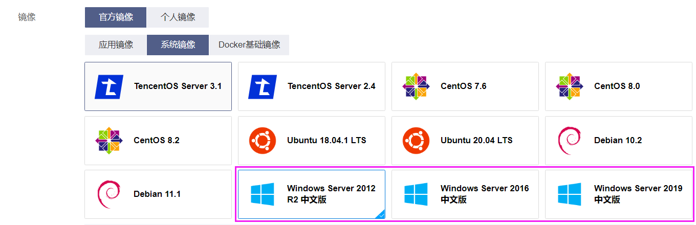

##### 腾讯云账号密码：

user：ser1@qq.com

pwd：15121322599aA@

##### 云产品 - 轻量应用服务器：

##### 新建windows镜像：

##### 配置远程登录用的账号密码：

user：Administrator

pwd：15121322599aA@

##### 远程登录：

win+R：`mstsc`

输入公网ip：

填写用户名和密码。

##### 连接远程桌面后

安装python3.9，并把在环境变量添加python和pip（路径在python的安装目录下）

安装django：`pip install django==2.2.*`（太慢可在其后补上 `-i https://pypi.tuna.tsinghua.edu.cn/simple`）

安装mysql：`pip install mysqlclient`

安装mysql for windows server：`https://dev.mysql.com/downloads/installer/`（记住用户名、密码、端口号）

安装Navicat for MySQL并在里面新建1个数据库（需和django中使用的数据库名字相同）

在django目录中的目录框下输入cmd启动终端，执行django的数据库迁移命令。(最好先删除`myapp/migrations`中的`xxxx_initial.py`文件)

- 生成迁移文件：`$ python manage.py makemigrations`
- 执行迁移：`$ python manage.py migrate`

启动服务器：`python manage.py runserver 0.0.0.0:8000` 

##### 配置防火墙

最后在浏览器内输入 公网IP+端口 访问服务器即可。

eg：`http://101.42.89.231:8000/chart/`