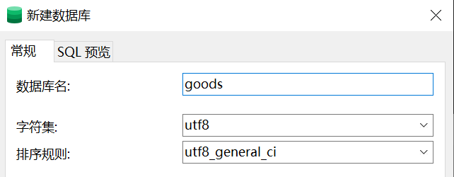

# Django

#### 常用命令 Order

创建项目：django-admin startproject [myproject]

创建应用：django-admin startapp [myapp]

启动服务：python manage.py runserver [8000]

启动服务：python manage.py runserver 0.0.0.0:8000

创建管理员账户：python manage.py createsuperuser

生成数据库迁移脚本：python manage.py makemigrations

执行数据库迁移脚本：python manage.py migrate

#### 目录结构

mysite `容器名` (可随意更改)

- apps `自定义应用`
  - myapp `应用名`
    - migrations `数据库迁移文件存放目录`
    - models.py `数据库字段`
    - view.py `视图函数`
- extra_apps `第三方应用`
- media `媒体文件`
- templates `模板文件`
- myproject `项目名`
  - setting.py `项目配置`
  - urls.py `路由分发，将url路径映射至视图函数`
  - wsgi.py `Web Server Gateway Interface`
- manage.py

##### 项目配置

```python
'''setting.py'''
import os
import sys
BASE_DIR = os.path.dirname(os.path.dirname(os.path.abspath(__file__)))
sys.path.insert(0, BASE_DIR)
sys.path.insert(0, os.path.join(BASE_DIR, 'apps'))
sys.path.insert(0, os.path.join(BASE_DIR, 'extra_apps'))
```

#### 数据库 Database

```python
'''setting.py'''
DATABASES = {
    'default': {
        'ENGINE': 'django.db.backends.mysql',
        'NAME': "uykshop",
        'USER': 'root',
        'PASSWORD': '123456',
        'HOST': 'localhost',
        'PORT': 3306,
    }
}
```

#### 静态资源 Media

```python
'''setting.py'''
MEDIA_URL = "/media/"
MEDIA_ROOT = os.path.join(BASE_DIR, "media")

'''urls.py'''
from django.conf.urls import url
from .settings import MEDIA_ROOT
from django.views.static import serve
urlpatterns = [
    url(r'^media/(?P<path>.*)$', serve, {"document_root": MEDIA_ROOT}),
]

'''browser.exe'''
localhost:8000/media/image.png
```

# RESTful API

简单理解：前后端分离的设计模式下，后端给前端提供的API接口的设计规范。

https://www.jianshu.com/p/84568e364ee8

https://www.ruanyifeng.com/blog/2014/05/restful_api.html

`REST`：Representational State Transfer (资源的)表现层状态转化

* 资源 Resources：网络上的信息实体。(eg：文字/音乐/图片...)

> `URI`：Uniform Resource Identifier 统一资源标识符
>
> `URL`：Uniform Resource Location 统一资源定位符
>
> （设计URI时不要带动词）

* 表现层 Representation：资源的具体呈现形式。(eg：txt/json/xml/html/png...)

> 由 Response Headers 中的 Accept & Content-Type 字段指定

* 状态转化 State Transfer：客户端和服务器互动过程中，涉及到的数据和状态的变化。(eg：资源的 新建/取出/更新/删除...)

> 请求方式 Request Method：http://tools.jb51.net/table/http_request_method
>
> ```undefined
> GET（SELECT）：从服务器取出资源。
> POST（CREATE）：在服务器新建资源。
> PUT（UPDATE）：在服务器更新资源（客户端提供改变后的完整资源）。
> PATCH（UPDATE）：在服务器更新资源（客户端提供改变的属性）。
> DELETE（DELETE）：从服务器删除资源。
> ```

#### 状态码 Status Codes

```
200 OK - [GET]：服务器成功返回用户请求的数据。
201 CREATED - [POST/PUT/PATCH]：新建/修改数据成功。
202 Accepted - [*]：表示一个请求已经进入后台排队（异步任务）
204 NO CONTENT - [DELETE]：用户删除数据成功。
400 INVALID REQUEST - [POST/PUT/PATCH]：用户发出的请求有错误，服务器没有进行新建或修改数据的操作。
401 Unauthorized - [*]：表示用户没有权限（令牌、用户名、密码错误）。
403 Forbidden - [*] 表示用户得到授权（与401错误相对），但是访问是被禁止的。
404 NOT FOUND - [*]：用户发出的请求针对的是不存在的记录，服务器没有进行操作。
406 Not Acceptable - [GET]：用户请求的格式不可得（比如用户请求JSON格式，但是只有XML格式）。
410 Gone -[GET]：用户请求的资源被永久删除，且不会再得到的。
422 Unprocesable entity - [POST/PUT/PATCH] 当创建一个对象时，发生一个验证错误。
500 INTERNAL SERVER ERROR - [*]：服务器发生错误，用户将无法判断发出的请求是否成功。
```

#### 错误处理 Error handling

如状态码是4xx，就应该向用户返回出错信息。以error作键名，出错信息作键值。

```json
{ error: "Invalid API key" }
```

# Django REST framework `DRF`

`document`：https://www.django-rest-framework.org/

> ORM：Object Relational Mapping 对象关系映射

**Django**：通过ORM的映射从数据库中取出数据，通过view文件，按照template文件排出的渲染成HTML。

**DRF**：通过ORM的映射从数据库中取出数据，通过view和serializers文件绑定REST接口，返回序列化好的json。

---

| MVC                        | MVP                        | MVVM                        |
| -------------------------- | -------------------------- | --------------------------- |
| Model-View-Controller      | Model-View-Presenter       | Model-View-ViewModel        |
|  |  |  |
| 单向通信                   | 双向通信                   | 双向绑定 data-binding       |

> 作用：将业务模型M和用户界面V的实现代码进行分离。
>
> 如某份统计数据(业务模型M)可用折线图/柱状图/饼图等展示方式(用户界面V)。

> MVC：模型（Model）、视图（View）和控制器（Controller）
>
> > 不同平台的实现会有些许区别
> >
> > - V->C->M->V （eg：PureMVC）：M&V的交互式通过观察者模式(Observer)实现的。view需事先在model中注册，然后观测model的变化，当model发生变化的时候，通知view发生改变。
> > - V->C->M->C->V (eg：`Web MVC` ASP.Net MVC/Spring MVC)
>
> MVP：View 与 Model 不发生联系，都通过 Presenter 传递。
>
> MVVM：View的变动，自动反映在 ViewModel，反之亦然。

Refer：[1][https://www.baidu.com/link?url=cajG49bvD3jzxvEYojqY4AbOt_Cv6RpNmkhNPRnJECZUQwyT7ZCsWBgyyPo0jS_PlDpKsOPGEh6ip1NPdHgf0uMSioZJ-NAvcuDQMXUhSk7&wd=&eqid=82fb69850000cac600000006621761ee] [2][https://www.cnblogs.com/keitsi/p/5764785.html]

---

##### 导入：

```python
'''settings.py'''
INSTALLED_APPS = [
    'rest_framework',
]
```

---

Mixins：提供 增删查改 的接口。(create，list，retrieve，update，destroy)

GenericAPIView：提供 过滤器filter 和 分页器pagination 的功能。

GenericViewSet：提供便捷的 HTTP方法 和 Mixins方法 绑定方式。

继承关系：View  `django` → APIView  `drf` → GenericAPIView  `drf` → GenericViewSet  `drf`

#### 使用
> > 说明：`./` 指项目根目录
>
> `./cmd`：
>
> ```
> pip install pillow
> pip install mysqlclient
> pip install django==3.2
> pip install django-filter
> pip install djangorestframework
> ```
>
> `./cmd`：
>
> ```apl
> django-admin startproject shop # 创建名为shop的项目
> cd shop # 进入名为shop的目录
> mkdir apps # 创建名为apps的目录
> mkdir media # 创建名为media的目录
> 
> cd apps # 进入名为apps的目录
> django-admin startapp goods # 创建名为goods的应用
> ```
>
> `mysql`：
>
> 
>
> `./shop/settings.py`：
>
> ```python
> 
> ```
>
> `./apps/goods/models.py`：
>
> ```python
> 
> ```
>
> `./cmd`：
>
> ```apl
> python manage.py makemigrations
> python manage.py migrate
> # 请确保在执行数据库迁移命令前已新建数据库
> ```
>
> `./apps/goods/serializers.py`：
>
> ```python
> from rest_framework import serializers
> from .models import Goods, Category
> 
> class CategorySerializer(serializers.ModelSerializer):
>  class Meta:
>      model = Category
>      fields = "__all__"
> 
> class GoodsSerializer(serializers.ModelSerializer):
>  category = CategorySerializer()  # 序列化嵌套
> 
>  class Meta:
>      model = Goods
>      # fields = "__all__"  # 可全部字段，也可指定字段
>      fields = ('name', 'image', 'category')
>      # 注：DRF 会在 ImageField/FileField 的字段前自动补上 MEDIA_URL
> ```
>
> `./apps/goods/views.py`：
>
> ```apl
> python manage.py runserver # 启动服务器
> ```
>
> `browser.exe`
>
> ```apl
> localhost:8000/goods
> ```


